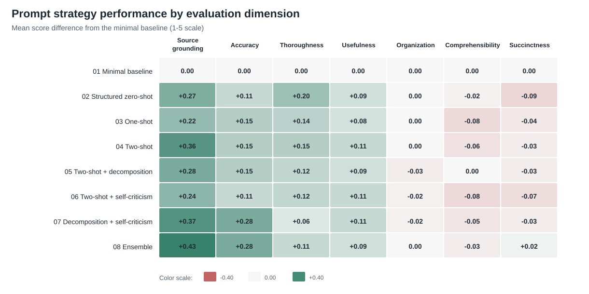

# Prompt Strategies for AI-Generated Clinical Summaries

Research code, prompts, evaluation tools, and public data for a 60 ECTS
master's thesis in Industrial Economics at the Norwegian University of Life
Sciences (NMBU), completed in spring 2026 by Rajvir Singh Aujla and Joakim Otto
Ruud.

## TL;DR

We generated 528 clinical summaries from 66 simulated ACI-Bench consultations
and compared eight prompt strategies across seven quality dimensions. The
ensemble configuration had the highest observed mean score (4.723 versus 4.595
for the baseline), but it was not clearly separated from two-shot prompting or
decomposition with self-criticism. A limited manual check indicates that the
LLM judge is useful for relative comparisons under matched conditions, but does
not validate it as a measure of clinical utility.

## Research question

> How do different prompt strategies affect the quality of AI-generated
> clinical summaries from simulated clinical consultations?

The study examined:

1. Which instruction and prompt strategies achieved the highest overall
   quality relative to a minimal baseline.
2. How the strategies affected source grounding, factual accuracy, and
   completeness.
3. Whether a limited manual agreement check supported using an LLM judge for
   evaluation within this experiment.

## Results

The main analysis used all 22 consultations in each of the `test1`, `test2`,
and `test3` ACI-Bench splits. Each consultation was processed with all eight
strategies, giving 528 generated summaries.

| Rank | Prompt strategy | Mean score | 95% CI | Difference from baseline | Win rate vs. baseline |
| ---: | --- | ---: | ---: | ---: | ---: |
| 1 | Ensemble | 4.723 | [4.675, 4.771] | +0.128 | 54.5% |
| 2 | Decomposition + self-criticism | 4.699 | [4.639, 4.755] | +0.104 | 45.5% |
| 3 | Two-shot | 4.693 | [4.628, 4.751] | +0.097 | 54.5% |
| 4 | Two-shot + decomposition | 4.680 | [4.623, 4.732] | +0.084 | 50.0% |
| 5 | Structured zero-shot | 4.675 | [4.617, 4.732] | +0.080 | 53.0% |
| 6 | One-shot | 4.662 | [4.597, 4.723] | +0.067 | 43.9% |
| 7 | Two-shot + self-criticism | 4.654 | [4.600, 4.703] | +0.058 | 45.5% |
| 8 | Minimal baseline | 4.595 | [4.519, 4.667] | - | - |

The largest observed difference was 0.128 points on a 1-5 scale. Pairwise
confidence intervals within the leading group included zero, so the results do
not establish a single robustly superior strategy.



The figure shows mean score differences from the minimal baseline. It is
generated from dimension means rounded to two decimals and transcribed from
Figure 5.1 of the thesis; the values and plotting script are included in
[`docs/readme_dimension_scores.csv`](docs/readme_dimension_scores.csv) and
[`src/plot_readme_results.py`](src/plot_readme_results.py).

Three patterns were most relevant:

- Differences were largest for source grounding and accuracy. Organization,
  comprehensibility, and succinctness were close to the maximum score for most
  strategies.
- The ensemble had the highest source-grounding score and tied for the highest
  accuracy score. Structured zero-shot prompting had the highest thoroughness
  score.
- The results suggest a possible tension between completeness and factual
  precision, but the experiment does not establish this as a general
  relationship.

### Manual agreement check

The manual comparisons were small controls, not a clinical validation study.
Agreement was stronger in the non-clinical review (`n = 40`, Spearman
correlation 0.714 across seven dimensions) than in the clinical review
(`n = 16`, Spearman correlation 0.257 across four dimensions). We therefore
treat the judge scores as a measure of relative performance under matched
experimental conditions, not as evidence of clinical effectiveness.

## Experimental design

The generator and judge were both configured with GPT-5.4:

| Component | Endpoint | Temperature | Maximum output tokens | Reasoning effort |
| --- | --- | ---: | ---: | --- |
| Generator | Responses API | 0.0 | 1,500 | Default |
| Judge | Responses API | 0.0 | 16,000 | High |

The primary score is the mean of seven fixed evaluation dimensions adapted from
PDSQI-9:

1. Source grounding
2. Accuracy
3. Thoroughness
4. Usefulness
5. Organization
6. Comprehensibility
7. Succinctness

Optional abstraction and synthesis fields are not part of the primary score.
Separate voice-related flags are also excluded from the seven-dimension result.

The eight configurations range from a minimal zero-shot baseline to examples,
task decomposition, self-criticism, and an ensemble that generates three
candidates before selecting a final summary. Their definitions are stored in
[`configs/strategies.json`](configs/strategies.json), with the corresponding
prompt text under [`prompts/`](prompts/).

## Repository contents

| Path | Purpose |
| --- | --- |
| `configs/` | Prompt strategy and model endpoint configuration |
| `prompts/` | Generation prompts and the judge prompt |
| `data/aci_bench/` | Public ACI-Bench input data |
| `src/run_generate.py` | Generate summaries for one or more dataset splits |
| `src/run_judge.py` | Evaluate generated summaries with the LLM judge |
| `src/explore_results.py` | Bootstrap analysis, comparisons, tables, and figures |
| `src/plot_results.py` | Standard result plots |
| `src/compare_judge_manual.py` | Compare judge output with manual scores |
| `tests/` | Unit and pipeline integration tests |

This public repository does not include generated `runs/` directories, private
results, or data from the local plausibility check conducted in the context of
the collaboration between the Oslo Municipality Health Agency and Bouvet. The
two Excel workbooks in the repository root are public appendices used for
manual evaluation and judge comparison.

## Setup

Create a virtual environment:

```bash
python -m venv venv
```

Activate the environment:

```bash
# macOS / Linux
source venv/bin/activate

# Windows PowerShell
venv\Scripts\Activate.ps1
```

Install the dependencies:

```bash
pip install -r requirements.txt
```

Create a `.env` file in the repository root, using `.env.example` as a
template:

```text
OPENAI_API_KEY=sk-...
```

The `.env` file is ignored by Git and must not be committed.

## Data

The project uses the `aci_asrcorr` transcript variant from
[ACI-Bench](https://github.com/wyim/aci-bench), stored under:

```text
data/aci_bench/src_experiment_data_json/
```

The repository includes the `train`, `valid`, `test1`, `test2`, and `test3`
splits. Rows are mapped to internal identifiers with this format:

```text
{split}:aci_asrcorr:{file}
```

For example:

```text
test1:aci_asrcorr:0-aci
```

The first two training examples are reserved for one-shot and two-shot
prompting and are excluded from evaluation:

```text
train:aci_asrcorr:0-aci
train:aci_asrcorr:1-aci
```

ACI-Bench is described in
[ACI-BENCH: a Novel Ambient Clinical Intelligence Dataset for Benchmarking Automatic Visit Note Generation](https://www.nature.com/articles/s41597-023-02487-3).
The dataset is distributed under the Creative Commons Attribution 4.0
International license (CC BY 4.0). See the
[original ACI-Bench repository](https://github.com/wyim/aci-bench) for its
license and citation information.

## Usage

Generate summaries for the three main analysis splits:

```bash
python src/run_generate.py \
  --strategies configs/strategies.json \
  --splits test1,test2,test3
```

Evaluate a completed generation run:

```bash
python src/run_judge.py --run-dir runs/<run_id>
```

Create analysis tables and figures:

```bash
python src/explore_results.py --run-dir runs/<run_id>
```

Model, endpoint, reasoning effort, and output limits are configured in
[`configs/endpoints.json`](configs/endpoints.json). Reasoning tokens count
towards `max_output_tokens`, which is why the judge has a larger output budget
than the generator.

### Resume interrupted runs

`run_generate.py` appends each completed record to `summaries.jsonl`. An
interrupted run can continue in the same directory:

```bash
python src/run_generate.py \
  --strategies configs/strategies.json \
  --splits test1,test2,test3 \
  --resume runs/<run_id>
```

Existing `(conversation_id, strategy_id)` pairs are skipped. Failed pairs are
recorded in `summaries_errors.jsonl` and attempted again on the next resume.

Judging can also resume:

```bash
python src/run_judge.py --run-dir runs/<run_id> --resume
```

### Compare with manual scoring

```bash
python src/compare_judge_manual.py \
  --run-dir runs/<run_id> \
  --manual path/to/manual_scoring.csv
```

The repository includes these manual evaluation appendices:

```text
manual_evaluation_2samtaler_tilbakemeldinger.xlsx
manuell_dommeranalyse_5samtaler.xlsx
```

The comparison script expects a CSV with named rubric columns. Private
evaluation files and local working data remain outside this repository.

## Limitations

- ACI-Bench contains simulated consultations and cannot establish performance
  in routine clinical use.
- The same model family was used for generation and automated evaluation,
  which may introduce evaluator bias.
- Several dimensions show ceiling effects, reducing their ability to
  distinguish between strategies.
- The manual agreement checks are small and do not validate the judge as a
  measure of clinical quality or utility.
- Generated runs and raw result files are not distributed in this public
  repository.

## Authors

- Rajvir Singh Aujla
- Joakim Otto Ruud

The thesis was conducted at NMBU in the context of a collaboration involving
the Oslo Municipality Health Agency and Bouvet.

## License

The code in this repository is licensed under the [MIT License](LICENSE).

The ACI-Bench dataset under `data/aci_bench/` is not covered by the repository's
MIT license. It remains subject to the source project's CC BY 4.0 license; see
the [ACI-Bench repository](https://github.com/wyim/aci-bench) for the original
terms and citation guidance.
